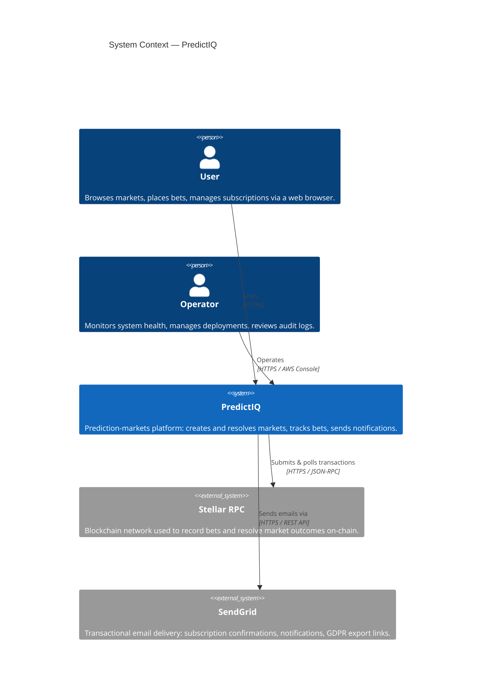
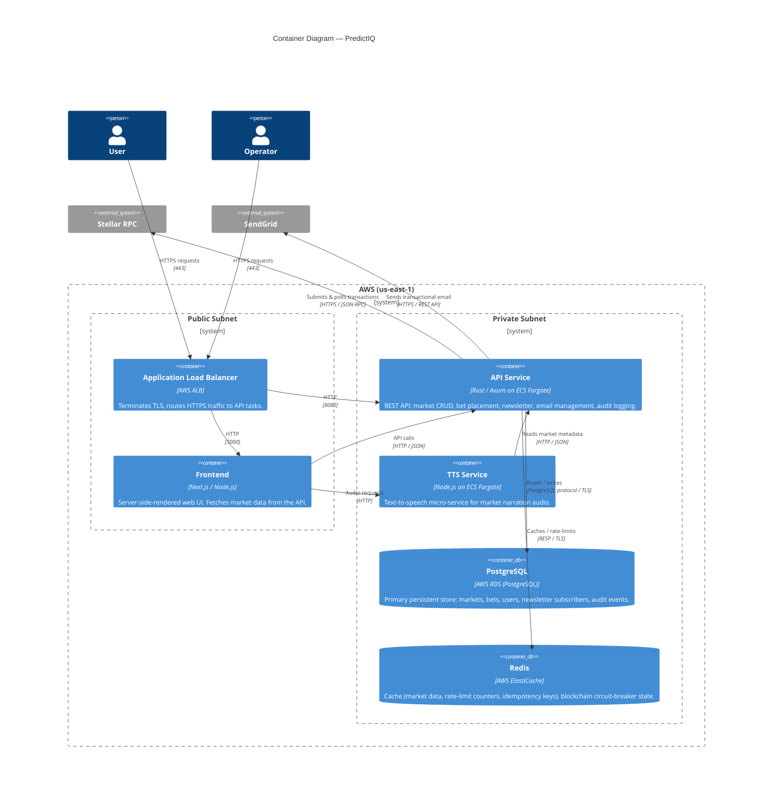

# PredictIQ — System Architecture

## System Context (C4 Level 1)

Shows PredictIQ and the external actors and systems it interacts with.

---

## Container Diagram (C4 Level 2)

Shows the deployable containers that make up PredictIQ and how they communicate. All containers run inside a single AWS VPC; the ALB and frontend are in public subnets while the API, databases, and TTS service live in private subnets.

---

## Network Boundaries

| Boundary | Contents | Inbound access |
|---|---|---|
| Public subnets | ALB, (optional) bastion host | Internet (0.0.0.0/0) on port 443 |
| Private subnets | ECS tasks (API, TTS), RDS, ElastiCache | Only from within the VPC |
| AWS Secrets Manager | Credentials (DB password, SendGrid key, etc.) | ECS task IAM role only |

---

## Key Technology Choices

| Component | Technology | Reason |
|---|---|---|
| API runtime | Rust / Axum | Memory-safe, high throughput, low latency |
| TTS service | Node.js | Rapid integration with browser-compatible TTS libraries |
| Frontend | Next.js | SSR for SEO; seamless API integration |
| Primary DB | PostgreSQL (RDS) | ACID guarantees for financial/market data |
| Cache / rate-limit | Redis (ElastiCache) | Sub-millisecond reads, built-in TTL, stream support |
| Blockchain | Stellar (Soroban) | Low-fee, fast-finality smart contracts |
| Email | SendGrid | Reliable delivery, webhook support for tracking |
| Compute | AWS ECS Fargate | Serverless containers; no EC2 management |
| IaC | Terraform | Reproducible, version-controlled infrastructure |

---

## Architecture Review — PR Checklist

When a pull request changes any of the components documented above, update this file as part of the PR. Specifically review if the change affects:

- [ ] A new or removed service / container
- [ ] A new external dependency (third-party API, data store, etc.)
- [ ] A change in network boundary (e.g. moving a service to a public subnet)
- [ ] A change in communication protocol between services
- [ ] A significant change to data-at-rest or data-in-transit trust boundaries
