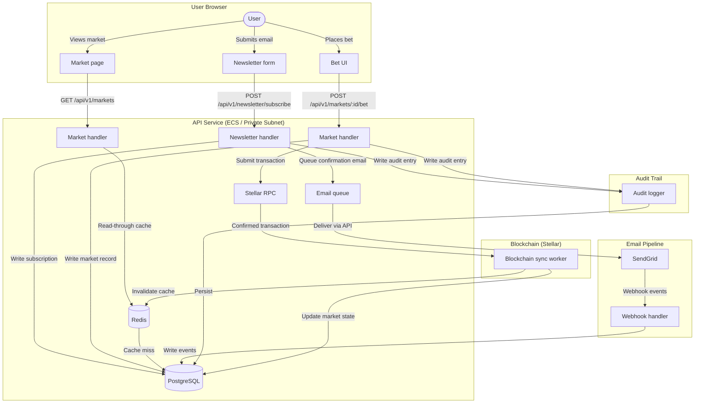

# PredictIQ — Data Flow & Lifecycle

This document describes how each major data type flows through PredictIQ: where it is collected, where it is stored, how long it is retained, how it is deleted, and who has access. It is intended to support GDPR/privacy compliance and internal security reviews.

---

## Data Flow Overview



---

## Data Types

### 1. Email Addresses (Newsletter Subscribers)

| Attribute | Detail |
|---|---|
| **Collection point** | `POST /api/v1/newsletter/subscribe` — user submits email voluntarily |
| **Storage — primary** | `newsletter_subscribers` table in PostgreSQL (RDS, private subnet) |
| **Storage — cache** | Not cached in Redis |
| **Storage — email processor** | Forwarded to SendGrid for delivery; SendGrid stores message metadata in its own system (see SendGrid DPA) |
| **Retention** | Active subscribers: indefinitely while subscribed. Unsubscribed rows: retained with `unsubscribed_at` timestamp for suppression purposes (prevents re-subscription after unsubscribe). To-be-purged after 2 years from `unsubscribed_at` (policy; implement via scheduled job). |
| **Deletion mechanism** | `POST /api/v1/newsletter/gdpr-delete` hard-deletes the subscriber row and all linked audit entries; confirmation token is invalidated. SendGrid suppression list must be cleared separately via SendGrid API. |
| **Data export** | `GET /api/v1/newsletter/gdpr-export?email=…` returns all stored data fields for the subject. |
| **Who has access** | API service (write/read via service account); DB admin via RDS IAM auth; no direct user read-back of other subscribers |

**Flow:**

```
User → POST /subscribe → [validate email] → newsletter_subscribers (PostgreSQL)
                                          → email_jobs queue → SendGrid → confirmation email
                                          → audit_logs (action=subscribe, actor_ip)
```

---

### 2. Subscription Status

| Attribute | Detail |
|---|---|
| **Collection point** | Set to `confirmed=false` on subscribe; set to `confirmed=true` on `GET /api/v1/newsletter/confirm?token=…` |
| **Storage** | `newsletter_subscribers.confirmed`, `confirmed_at`, `unsubscribed_at` columns in PostgreSQL |
| **Retention** | Lifetime of the subscription record (see above) |
| **Deletion** | Deleted with the parent subscriber row (GDPR delete endpoint) |
| **Who has access** | API service (internal reads for email eligibility checks) |

**States:** `pending_confirmation → confirmed → unsubscribed`

---

### 3. Audit Events

| Attribute | Detail |
|---|---|
| **Collection point** | Written automatically by the audit middleware on every mutating request (`AuditLogger::create_entry`) |
| **Storage** | `audit_logs` table in PostgreSQL |
| **Fields stored** | `action`, `entity_type`, `entity_id`, `actor_email`, `actor_ip`, `reason`, `changes` (JSONB diff), `created_at` |
| **Retention** | Minimum 7 years for financial/compliance events; 2 years for operational events. Retention tiers should be enforced by a scheduled archival job (not yet implemented — see TODO). |
| **Deletion mechanism** | Soft-delete (`deleted_at` column) only. Hard deletes are not performed on audit rows to preserve regulatory trail. GDPR right-to-erasure is satisfied by pseudonymising `actor_email` (replacing with a SHA-256 hash) without deleting the row. |
| **Who has access** | `GET /api/v1/audit/logs` and `GET /api/v1/audit/statistics` — API-key authenticated; API service account (write); DB admin |

---

### 4. Market Data

| Attribute | Detail |
|---|---|
| **Collection point** | Created via internal admin API or smart contract event; updated by blockchain sync worker |
| **Storage — primary** | `markets` table in PostgreSQL (`id`, `title`, `status`, `outcome_index`, `total_volume`, `ends_at`, `created_at`, `resolved_at`) |
| **Storage — cache** | Market lists and detail views cached in Redis under `market:*` keys with configurable TTL (`REDIS_CACHE_TAG_TTL_SECS`); invalidated on market state changes by the blockchain sync worker |
| **Storage — blockchain** | Market outcomes and bet results are immutably recorded on the Stellar (Soroban) contract; this is the authoritative settlement layer |
| **Retention** | Indefinite — market history is required for audit and dispute resolution |
| **Deletion** | Markets are not deleted; they transition to `resolved` or `cancelled` status |
| **Who has access** | Public read (`GET /api/v1/markets`, `GET /api/v1/blockchain/market/:id`); write restricted to service account and blockchain sync worker |

**Flow:**

```
Admin / Contract event
  → POST /api/v1/markets (create)  → markets (PostgreSQL) → Redis (cache invalidated)
  → Blockchain sync worker polls Stellar RPC
      → updates market.status, outcome_index, total_volume in PostgreSQL
      → invalidates Redis cache tags (market_list, market_detail)
```

---

### 5. On-Chain Bets (Stellar / Soroban)

| Attribute | Detail |
|---|---|
| **Collection point** | User submits a signed Stellar transaction via the frontend; API proxies it to Stellar RPC |
| **Storage** | Stellar blockchain (immutable ledger); bet metadata mirrored in PostgreSQL via `blockchain_user_bets` read from contract state |
| **Retention** | Immutable on-chain — cannot be deleted. PostgreSQL mirror retained indefinitely |
| **Deletion** | Not possible for on-chain data. PostgreSQL mirror rows are not deleted |
| **Who has access** | Public on-chain (permissionless read of Stellar ledger); API via Stellar RPC (`GET /api/v1/blockchain/user-bets/:address`); DB admin |

---

### 6. Email Tracking & Delivery Events

| Attribute | Detail |
|---|---|
| **Collection point** | SendGrid posts webhook events (sent, delivered, opened, clicked, bounced, complained, unsubscribed) to `POST /api/v1/email/sendgrid-webhook` |
| **Storage** | `email_jobs` (outbound queue), `email_events` (delivery events), `email_suppressions` (bounces/complaints), `email_analytics` (aggregates) — all in PostgreSQL |
| **Retention** | `email_jobs`: 90 days after completion. `email_events`: 1 year (for deliverability analysis). `email_suppressions`: indefinite (required to prevent re-sending to hard-bounced or complaining addresses). `email_analytics`: indefinite (aggregate, non-personal). |
| **Deletion** | Cascades from `email_jobs` on hard delete (`email_events` cascade). `email_suppressions` cleared only when explicitly re-enabling a suppressed address. |
| **Who has access** | API service (write via webhook); `GET /api/v1/email/analytics`, `GET /api/v1/email/queue-stats`, `GET /api/v1/email/dead-letter` — API-key authenticated |

---

### 7. Analytics Events

| Attribute | Detail |
|---|---|
| **Collection point** | Client-side events written via the frontend; stored in `analytics_events` table |
| **Fields stored** | `event_name`, `user_id` (optional UUID), `session_id`, `page_url`, `referrer`, `properties` (JSONB), `ip_address`, `user_agent` |
| **Storage** | `analytics_events` table in PostgreSQL |
| **Retention** | 2 years from `occurred_at` |
| **Deletion** | Scheduled cleanup job (not yet implemented); on GDPR delete request, rows matching `user_id` are purged; rows with no `user_id` are pseudonymised (IP zeroed, user-agent cleared) |
| **Who has access** | API service (write); internal analytics tooling (read via DB replica or export) |

---

### 8. Transient / Short-Lived Data (Redis)

| Data | Key pattern | TTL | Purpose |
|---|---|---|---|
| Market cache | `market:list:*`, `market:detail:*` | `REDIS_CACHE_TAG_TTL_SECS` (default 3600 s) | Read-through cache for market listings |
| Rate-limit counters | `rl:{ip}:{window}` | Sliding window (per request) | Newsletter subscription rate limiting |
| Idempotency keys | `idempotency:{key}` | 24 h | Prevent duplicate newsletter confirmations |
| Blockchain circuit-breaker | `bc:circuit:*` | In-memory (process restart resets) | Tracks consecutive Stellar RPC failures |
| Email queue processing | Redis streams / sorted sets | Until consumed | In-flight email job state |

Redis data is not subject to long-term retention policies — all keys expire automatically. Redis is not the system of record for any user PII.

---

## GDPR Data Subject Rights — Implementation Map

| Right | Endpoint / Mechanism |
|---|---|
| Right of access | `GET /api/v1/newsletter/gdpr-export?email=…` |
| Right to erasure | `POST /api/v1/newsletter/gdpr-delete` |
| Right to rectification | Not yet implemented — contact data team |
| Right to object (unsubscribe) | `GET /api/v1/newsletter/unsubscribe?token=…` |
| Data portability | GDPR export endpoint returns JSON |

> **Note:** On-chain data (Stellar bets) is technically impossible to erase. Inform data subjects of this limitation in the privacy policy before they place bets.

---

## Access Control Summary

| Data store | Access method | Who |
|---|---|---|
| PostgreSQL (RDS) | sqlx connection pool (`DATABASE_URL`) | API service task only; DB admin via RDS IAM auth |
| Redis (ElastiCache) | deadpool-redis (`REDIS_URL`) | API service task only |
| Stellar RPC | HTTPS / JSON-RPC (`BLOCKCHAIN_RPC_URL`) | API service task only |
| SendGrid | HTTPS REST (`SENDGRID_API_KEY`) | API service task only |
| AWS Secrets Manager | IAM role (`ECS_TASK_ROLE`) | ECS task role; no human access in production |

---

## Outstanding Items

- [ ] Implement scheduled PostgreSQL cleanup jobs for: `email_jobs` > 90 days, `email_events` > 1 year, `analytics_events` > 2 years
- [ ] Implement pseudonymisation of `actor_email` in `audit_logs` for GDPR erasure requests
- [ ] Document `contact_form_submissions` and `waitlist_entries` retention (tables exist in migrations 003/004 but are not yet surfaced in this document)
- [ ] Obtain a signed Data Processing Agreement (DPA) with SendGrid covering the email addresses forwarded for delivery
- [ ] Add `user_id` linkage to `analytics_events` GDPR delete path
